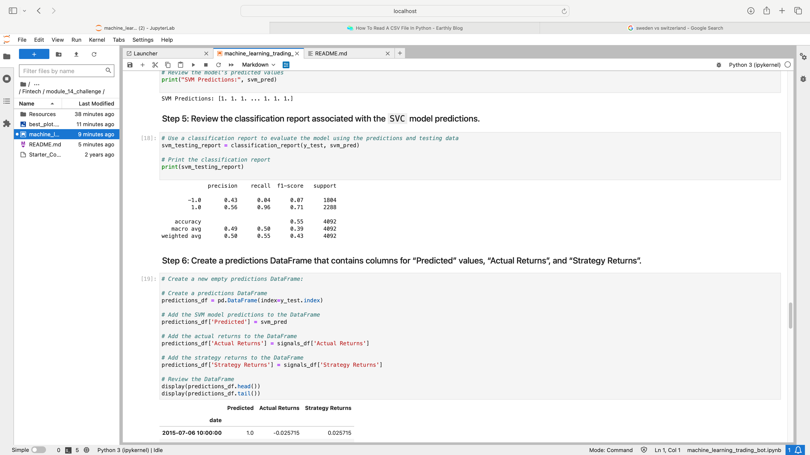

# module_14_challenge

# Performance of the Baseline Trading Algorithm
I conclude that the 'Baseline Trading Algorithm' is notperforming satisfactorily. As you can see below there are major deviances from the strategy returns.

This is further reinforced by the classification report below which shows unimpressive scores.

## Code
All code is my own. Created with minimal troubleshooting on forums.